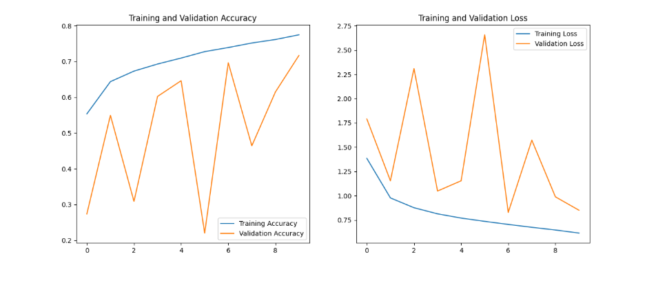

# 🌿 Cassava Leaf Disease Classification
**Deep Learning & Computer Vision for Agricultural Intelligence**

## 📌 Project Overview
Cassava is a staple food for millions, but viral diseases can devastate entire harvests. This project focuses on building an automated **Computer Vision** pipeline to identify four distinct diseases and distinguish them from healthy plants. 

By applying **Convolutional Neural Networks (CNNs)**, this system serves as a scalable solution for early disease detection, reducing the manual labor of agricultural inspection.

---
## 📂 Dataset

The dataset used is the Cassava Leaf Disease Classification Dataset from Kaggle.

Classes:
1.Cassava Bacterial Blight (CBB)

2.Cassava Brown Streak Disease (CBSD)

3.Cassava Green Mottle (CGM)

4.Cassava Mosaic Disease (CMD)

*Healthy

## ⚙️ Project Workflow

1.Data loading and preprocessing

2.Image resizing and normalization

*CNN model building

3.Model training and validation

4.Performance evaluation

## 🧠 Model Architecture

The model uses a Convolutional Neural Network (CNN) consisting of:

1.Convolution layers for feature extraction

2.MaxPooling layers to reduce dimensionality

3.Dropout layers to prevent overfitting

4.Fully connected dense layers for classification

5.The model is trained using the Adam optimizer and categorical cross-entropy loss.

## 📊 Model Performance & Visualization
*Here are the results captured during the model training and evaluation phase:*

  

  

  

---

##  Technical Highlights
### The Pipeline
1. **Exploratory Data Analysis (EDA):** Visualized class distributions and identified visual markers for Bacterial Blight vs. Mosaic Disease.
2. **Data Augmentation:** To combat over-fitting, I implemented real-time augmentations (rotation, zoom, and horizontal flips) using `ImageDataGenerator`.
3. **Model Architecture:** Leveraged a custom **CNN architecture** (or transfer learning) optimized for high-resolution leaf images.

### 🚀 Challenges Overcome
* **Class Imbalance:** Handled datasets where certain diseases were more prevalent than others to ensure the model didn't become biased.
* **Feature Similarity:** Fine-tuned the model to distinguish between subtle brown streaks and bacterial spots which look similar to the naked eye.
---
